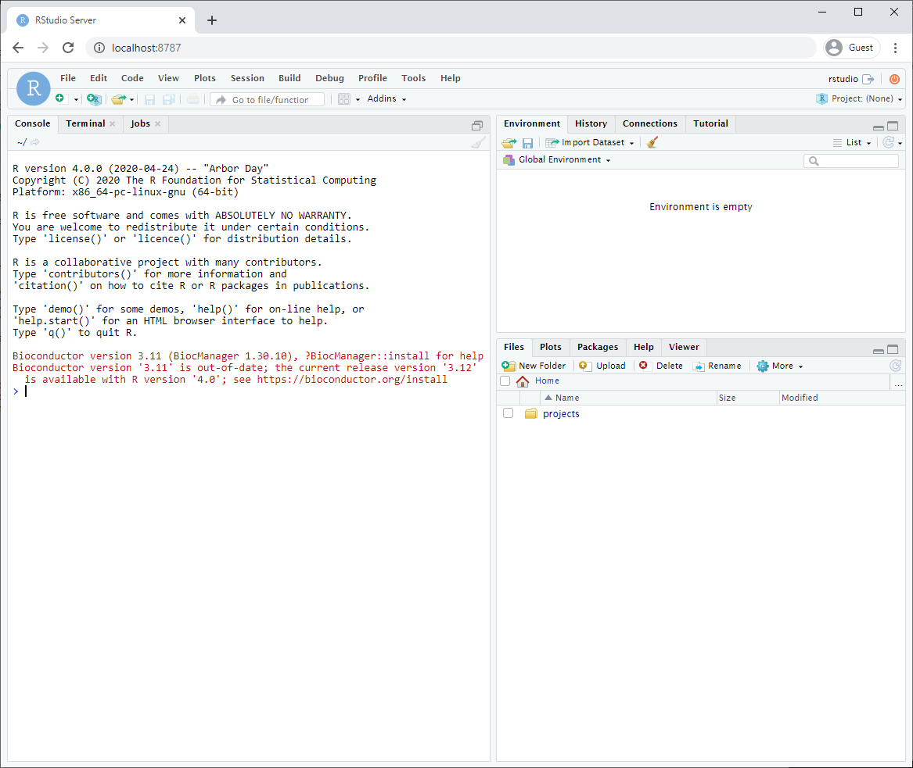

--- 
title: "CBW pathways Workshops - example R notebooks"
author: "Ruth Isserlin"
date: "2024-06-19"
site: bookdown::bookdown_site
output: bookdown::gitbook
documentclass: book
bibliography: [book.bib, packages.bib]
biblio-style: apalike
cover-image: images/cover.png
link-citations: yes
github-repo: risserlin/CBW_pathways_workshop_R_notebooks
description: "These are example R Notebooks to run g:profiler and GSEA and visualize results in Cytoscape with Enrichment map directly from R"
---

# Index


<!--chapter:end:index.Rmd-->

# CBW Workshop example R Notebooks {#intro}

Do you want to run the pathways and network analysis from R instead of doing everything mannually as demonstrated in the workshop?

Everything (almost!) that was discussed in the lectures and practicals can be done computationally through R.


We are using the **bookdown** package [@R-bookdown] in this Workshop R Notebooks book, which was built on top of R Markdown and **knitr** [@xie2015].

<!--chapter:end:01-intro.Rmd-->

# Setup

## Install R and RStudio

As with many open source projects, **R** is a constantly evolving language with regular updates.  There is a major release once a year with patch releases through out the year.  Often scripts and packages will work from one release to the next (ignoring pesky warnings that a package was compiled on a previous version of R is common) but there are exceptions.  Some newer packages will only work on the latest version of **R** so sometimes the choice of upgrading or not using a new package might present themselves.  Often, the amount of packages and work that is need to upgrade is not realized until the process has begun.  This is where docker demonstrates it most valuable features.  You can create a new instance based on the latest release of **R** and all your needed packages without having to change any of your current settings. 

In order to use these notebooks supplied here you need to have:

  * **R** installed on your computer and 
  * a list of packages.  (including BiocManager, BiomaRt, gprofiler2, GSA)
  
Each notebook in this set will check for the required packages and install them if they are missing so at the base level you need to just have **R** installed.  

There are many different ways you can use and setup **R**.  

  1. By simply installing **R** you can use it directly but 
  1. it is highly recommended that you also install and use [RStudio](https://rstudio.com/products/rstudio/download/) which is an Integrate development environment (IDE) for **R**.  You cannot just download RStudio and use it.  It requires an installation of **R**. 

You don't need to install R and RStudio though.  You can also use **R** and RStudio through docker. **I highly recommend using docker instead**


## Docker [Optional]

Changing versions and environments are a continuing struggle with bioinformatics pipelines and computational pipelines in general.  An analysis written and performed a year ago might not run or produce the same results when it is run today.  Recording package and system versions or not updating certain packages rarely work in the long run.  

One the best solutions to reproducibility issues is containing your workflow or pipeline in its own coding environment where everything from the operating system, programs and packages are defined and can be built from a set of given instructions. There are many systems that offer this type of control including:

  * [Docker](https://www.docker.com/).
  * [Singularity](https://sylabs.io/)
  
"A container is a standard unit of software that packages up code and all its dependencies so the application runs quickly and reliably from one computing environment to another." [@docker] 

**Why are containers great for Bioiformatics?**

  * allows you to create environments to run bioinformatis pipelines.
  * create a consistent environment to use for your pipelines.
  * test modifications to the pipeline without disrupting your current set up.
  * Coming back to an analysis years later and there is no need to install older versions of packages or programming languages. Simply create a container and re-run.  

## Install Docker

  1. Download and install [docker desktop](https://www.docker.com/products/docker-desktop).
  1. Follow slightly different instructions for Windows or MacOS/Linux

### Windows
  * it might prompt you to install additional updates (for example - https://docs.Microsoft.com/en-us/windows/wsl/install-win10#step-4---download-the-linux-kernel-update-package) and require multiple restarts of your system or docker.
  * launch docker desktop app.
  * Open windows Power shell 
  * navigate to directory on your system where you plan on keeping all your code.  For example: C:\\USERS\\risserlin\\cbw_workshop_code
  * Run the following command: (the only difference with the windows command is the way the current directory is written.  \$\{PWD\} instead of \"\$(pwd)\")


``` r
docker run -e PASSWORD=changeit --rm \
  -v ${PWD}:/home/rstudio/projects -p 8787:8787 \
  risserlin/workshop_base_image
```
<p align="center"></p>  
  * Windows defender firewall might pop up with warning.  Click on *Allow access*.
  * In docker desktop you see all containers you are running and easily manage them. 
<p align="center"></p>   


### MacOS / Linux
  * Open Terminal
  * navigate to directory on your system where you plan on keeping all your code.  For example: /Users/risserlin/bcb420_code
  * Run the following command: (the only difference with the windows command is the way the current directory is written.   \$\{PWD\} instead of \"\$(pwd)\")


``` r
docker run -e PASSWORD=changeit --rm \
  -v "$(pwd)":/home/rstudio/projects -p 8787:8787 \
  --add-host "localhost:My.IP.address"
  risserlin/workshop_base_image
```
<p align="center"></p> 


<!--chapter:end:02-setup.Rmd-->

---
params:
  working_dir: ./generated_data/g_profiler
  data_dir: ./data
  genelist_file: Supplementary_Table1_Cancer_drivers.txt
  max_gs_size: 250
  min_gs_size: 3
  min_intersection: 3
  organism: hsapiens
---

# Run g:profiler from R

## Initialize variables and libraries

Detailed instructions on how to run [g:Profiler](https://biit.cs.ut.ee/gprofiler/gost) programmatically from R

The parameters are set manually here but if you want to run the script from the command line then you can update the notebook to pull the parameters from the command line given arguments by updating each variable below to pull the values from the paramters - for example:

  * variable <- params$parameter_name
  
For more details see - [defining and using parameters](https://bookdown.org/yihui/rmarkdown/params-declare.html) and [Knitting with parameters](https://bookdown.org/yihui/rmarkdown/params-knit.html)


``` r
#all parameters are pulled from the defined parameters at the top of the notebook

#where to put all the generated files
# for example - "./generated_data/g_profiler"
working_dir <- params$working_dir

# where to find the data files needed to run the analysis
# for example = "./data"
data_dir <-  params$data_dir

# File name containing the list of genes to be used for analysis
# fro example - "Supplementary_Table1_Cancer_drivers.txt"
genelist_file <- params$genelist_file

# default max size of the genesets for example -  250.  For this example we
# will be varying this parameter
max_gs_size <- params$max_gs_size

# default min size of the genesets for example -  3
min_gs_size <- params$min_gs_size

#min intersection between your genelist and the geneset - for example 3
min_intersection <- params$min_intersection

# organism parameter used for g:profiler.  
# First letter of first word in species name followed by 
# the second word for example - hsapiens
organism <- params$organism

#set the gmt file you want to use if you don't want to use the latest gmt file.
# For example, if you set dest_gmt_file =="" the below script will automatically
# download the latest gmt file from baderlab webstie.  If it is set then it
# will use the file specified.  
dest_gmt_file = ""
```


``` r
#use library
tryCatch(expr = { library("gprofiler2")}, 
         error = function(e) { 
           install.packages("gprofiler2")}, 
         finally = library("gprofiler2"))

tryCatch(expr = { library("GSA")}, 
         error = function(e) { 
           install.packages("GSA")}, 
         finally = library("GSA"))
```

Create or set a directory to store all the generatd results

``` r
if(!dir.exists(params$working_dir)){
  dir.create(params$working_dir)
}
```

## Load in Query set

Load in the set of genes that we will be running g:profiler with

``` r
 #load in the file
    current_genelist <- read.table(file = 
                                     file.path(data_dir, genelist_file),
                                   header = FALSE,
                                   sep = "\t", quote = "",
                                   stringsAsFactors = FALSE)

  query_set <- current_genelist$V1
```


With regards to pathway sets there are two options when using [g:Profiler](https://biit.cs.ut.ee/gprofiler/gost) - 

  * Use the genesets that are supplied by [g:Profiler](https://biit.cs.ut.ee/gprofiler/gost)
  * Upload your own genesets. 
  
The most common reasons for supplying your own genesets is the ability to use up to date annotations or in-house annotations that might not be available in the public sphere yet.  One of the greatest features of [g:Profiler](https://biit.cs.ut.ee/gprofiler/gost) is that it is updated on a regular basis and most of the previous versions are available online ont the [gprofiler archive](https://biit.cs.ut.ee/gprofiler/page/archives).

The [gprofielr2](https://biit.cs.ut.ee/gprofiler/page/r) -[g:Profiler](https://biit.cs.ut.ee/gprofiler/gost) R implementation is a wrapper for the web version.  You require an internet connection to get enrichment results.  

## Run g:profiler with supplied genesets

For detailed descriptions of all the parameters that can be specified for the gost g:profiler function see -[here](https://rdrr.io/cran/gprofiler2/man/gost.html)

For this query we are specifying - 

  * query - the set of genes of interest, as loaded in from the Supplementary_Table1_Cancer_drivers.txt file.
  * significant - set to FALSE because we want g:Profiler to return all the results not just the ones that it deems significant by its perdetermined threshold.
  * ordered_query - set to TRUE because for this set of genes they are ordered in order of their significance
  * correction_method - set to fdr.  by default g:Profiler uses g:Scs
  * organism - set to "hsapiens" for homo sapiens.  Organism names are constructed by concatenating the first letter of the name and the family name (according to gprofiler2 documentation)
  * source - the geneset source databases to use for the analysis.  We recommend using GO biological process (GO:BP), WikiPathways (WP) and Reactome (Reac) but there are additional sources you can add (GO molecular function or cellular component(GO:MF, GO:CC), KEGG, transcription factors (TF), microRNA targets (MIRNA), corum complexes (CORUM), Human protein atlas (HPA),Human phenotype ontology (HP) ) 


``` r
gprofiler_results <- gost(query = query_set ,
                          significant=FALSE,
                          ordered_query = FALSE,
                          exclude_iea=TRUE,
                          correction_method = "fdr",
                          organism = organism,
                          source = c("REAC","WP","GO:BP"))
```


``` r
 #get the gprofiler results table
enrichment_results <- gprofiler_results$result
    
enrichment_results[1:5,]
```

```
##     query significant      p_value term_size query_size intersection_size
## 1 query_1        TRUE 1.266713e-31      4791        117                99
## 2 query_1        TRUE 6.230929e-31      4911        117                99
## 3 query_1        TRUE 2.945299e-30      5297        117               101
## 4 query_1        TRUE 2.945299e-30      5313        117               101
## 5 query_1        TRUE 3.692367e-28      5757        117               102
##   precision     recall    term_id source
## 1 0.8461538 0.02066374 GO:0051171  GO:BP
## 2 0.8461538 0.02015883 GO:0080090  GO:BP
## 3 0.8632479 0.01906740 GO:0060255  GO:BP
## 4 0.8632479 0.01900998 GO:0031323  GO:BP
## 5 0.8717949 0.01771756 GO:0019222  GO:BP
##                                           term_name effective_domain_size
## 1 regulation of nitrogen compound metabolic process                 16178
## 2           regulation of primary metabolic process                 16178
## 3     regulation of macromolecule metabolic process                 16178
## 4          regulation of cellular metabolic process                 16178
## 5                   regulation of metabolic process                 16178
##   source_order                            parents
## 1        13995             GO:0006807, GO:0019222
## 2        18320             GO:0019222, GO:0044238
## 3        14938             GO:0019222, GO:0043170
## 4         7372 GO:0019222, GO:0044237, GO:0050794
## 5         5789             GO:0008152, GO:0050789
```

## Download and load g:profiler geneset file

In order to create a proper Generic enrichment results file we will need a copy of the gmt file used by g:Profiler. (also to create an Enrichment map).

Download the gmt file used for this analysis from g:profiler


``` r
#the link to the gmt file is static no matter what version
gprofiler_gmt_url <- 
  "https://biit.cs.ut.ee/gprofiler/static/gprofiler_full_hsapiens.name.gmt"

#get version info gprofiler as the gmt file is always associated with 
# a specific version of g:profiler
gprofiler_version <- get_version_info(organism=organism)

gprofiler_gmt_filename <- file.path(working_dir,
                                  paste("gprofiler_full", organism,
                                    gprofiler_version$gprofiler_version,sep="_",
                                    ".name.gmt"))

if(!file.exists(gprofiler_gmt_filename)){
  download.file(url = gprofiler_gmt_url, 
              destfile = gprofiler_gmt_filename)
}
```

To create a proper Generic enrichmentMap results file we need to include the list of genes that are associated with each geneset.  To do that we need to know what genes are associated with each set and filter them by our query set.  Load in the geneset definitions from the gmt file we just downloaded from g:profiler site.  


``` r
#load in the g:profiler geneset file
capt_output <- capture.output(genesets_gprofiler <- GSA.read.gmt(
                                      filename = gprofiler_gmt_filename))

names(genesets_gprofiler$genesets) <- genesets_gprofiler$geneset.names
```

For the next module the name of the gmt file is - gprofiler_full_hsapiens.name.gmt but it is important to preserve the database version so in the future when we revisit these results for publication or results verfication we have the exact version used.  Instead of creating a copy of the file (which can be pretty large) create a symbolic link to the file with the generic name.


``` r
#file.exists does not work for a symbolic link on my computer for some reason
# list the files in the directory and check if the symbolic link is there
#if(file.exists(file.path(working_dir, "gprofiler_full_hsapiens.name.gmt"))){
if(length(grep(x = list.files(file.path(working_dir)), 
              pattern = "gprofiler_full_hsapiens.name.gmt",
              fixed = TRUE) > 0 )){

  file.remove(file.path(working_dir, "gprofiler_full_hsapiens.name.gmt"))
}
```

```
## [1] TRUE
```

``` r
file.symlink( gprofiler_gmt_filename,file.path(working_dir, 
                                   "gprofiler_full_hsapiens.name.gmt"))
```

```
## [1] TRUE
```


``` r
# Given:
# query_genes - genes used for enrichment analysis (or as query)
#
# returns - the genes that overlap with the query set and part of the given
#           genesets
getGenesetGenes <- function(query_genes, subset_genesets){
  genes <- lapply(subset_genesets,FUN=function(x){intersect(x,query_genes)})
  
  # For each of the genes collapse to the comma separate text
  genes_collapsed <- unlist(lapply(genes,FUN=function(x){
                                                paste(x,collapse = ",")}))
  
  genes_collapsed_df <- data.frame(term_id = names(genes), 
                            genes = genes_collapsed,stringsAsFactors = FALSE)
  
  return(genes_collapsed_df)
}
```

## Filter results by geneset size

Filter the table to include just the columns that are required for the generic enrichment map file results [GEM](https://enrichmentmap.readthedocs.io/en/latest/FileFormats.html#generic-results-files). Restrict the results to just the ones that have at least min_gs_size and less than max_gs_size terms and  min_intersection size include only the term_id, term_name, p_value (and p_value again because the p_value is actually the corrected p-value.  The output file does not contain the nominal p_value.  For down stream analysis though it is expected to have both a p-value and a q-value so just duplicate the q-value as both p-value and q-value)

Vary the thresholds for max_gs_size just as we did in Module 2 lab - 

  * min_gs_size = 3
  
  * max_gs_size = 10000
  * max_gs_size = 1000
  * max_gs_size = 250
  


``` r
# filer by params defined above
# by default we have set the max and min gs size to 250 and 3, respectively.
enrichment_results_mxgssize_250_min_3 <- 
                        subset(enrichment_results,term_size >= min_gs_size & 
                                   term_size <= max_gs_size & 
                                   intersection_size >= min_intersection , 
                                 select = c(term_id,term_name,p_value,p_value ))

enrichment_results_mxgssize_1000_min_3 <- 
                        subset(enrichment_results,term_size >= min_gs_size & 
                                   term_size <= 1000 & 
                                   intersection_size >= min_intersection , 
                                 select = c(term_id,term_name,p_value,p_value ))

enrichment_results_mxgssize_10000_min_3 <- 
                        subset(enrichment_results,term_size >= min_gs_size & 
                                   term_size <= 10000 & 
                                   intersection_size >= min_intersection , 
                                 select = c(term_id,term_name,p_value,p_value ))
```


## Create an output file of the results - Generic enrichment Map file from g:profiler gmt

The file requires - 

  * name
  * description
  * p-value
  * q-value
  * phenotyp
  * list of genes (overlap of query set and original geneset)
  
  The list of genes needs to be calculated using the gmt file and original query set.  For each geneset found in the result find the overlap between the set of genes that are a part of the geneset and the query set. 


``` r
# Given:
# gprofiler_results - results form g_profiler R function (filtered by desired)
# parameters
# gs - genes associated with each geneset, loaded in from a gmt file. 
#
# returns - the properly formatted GEM file results
#
createGEMformat <- function(results, gs, query_genes){

  if(nrow(results) >0){    

           #add phenotype to the results
          formatted_results <- cbind(results,1)
          
          # Add the genes to the genesets
          subset_genesets <- gs$genesets[
            which(gs$geneset.names 
                  %in% results$term_id)]
          
          genes <- getGenesetGenes(query_genes, subset_genesets)
          
          formatted_results <- merge(formatted_results,genes,by.x=1, by.y=1)
          
          colnames(formatted_results) <- c("name","description","p-value",
                                           "q-value","phenotype","genes")
          
  }
  return(formatted_results)
}
```


``` r
enrichment_results_mxgssize_10000_min_3_GEMfile <- createGEMformat(
  enrichment_results_mxgssize_10000_min_3, genesets_gprofiler, query_set)

enrichment_results_mxgssize_1000_min_3_GEMfile <- createGEMformat(
  enrichment_results_mxgssize_1000_min_3, genesets_gprofiler, query_set)

enrichment_results_mxgssize_250_min_3_GEMfile <- createGEMformat(
  enrichment_results_mxgssize_250_min_3, genesets_gprofiler, query_set)
```


Output each of the above filtered files


``` r
#output the enrichment map file
write.table(enrichment_results_mxgssize_10000_min_3_GEMfile, 
            file = file.path(working_dir, 
                "gProfiler_hsapiens_lab2_results_GEM_termmin3_max10000.gem.txt"),
            row.names = FALSE, 
            col.names = TRUE, sep="\t",
            quote = FALSE)

#output the enrichment map file
write.table(enrichment_results_mxgssize_1000_min_3_GEMfile, 
            file = file.path(working_dir, 
                "gProfiler_hsapiens_lab2_results_GEM_termmin3_max1000.gem.txt"),
            row.names = FALSE, 
            col.names = TRUE, sep="\t",
            quote = FALSE)

#output the enrichment map file
write.table(enrichment_results_mxgssize_250_min_3_GEMfile, 
            file = file.path(working_dir, 
                "gProfiler_hsapiens_lab2_results_GEM_termmin3_max250.gem.txt"),
            row.names = FALSE, 
            col.names = TRUE, sep="\t",
            quote = FALSE)
```


## Run g:profiler with your own genesets (example using BaderLab genesets)

## Download and load Bader lab geneset file

Download the latest [Bader lab genesets](https://download.baderlab.org/EM_Genesets/current_release/Human/)


``` r
if(dest_gmt_file == ""){

  gmt_url = "http://download.baderlab.org/EM_Genesets/current_release/Human/symbol/"

  #list all the files on the server
  filenames = RCurl::getURL(gmt_url)
  tc = textConnection(filenames)
  contents = readLines(tc)
  close(tc)
  
  #get the gmt that has all the pathways and does not include 
  # terms inferred from electronic annotations(IEA)
  #start with gmt file that has pathways only
  rx = gregexpr("(?<=<a href=\")(.*.GOBP_AllPathways_noPFOCR_no_GO_iea.*.)(.gmt)(?=\">)",
    contents, perl = TRUE)
  gmt_file = unlist(regmatches(contents, rx))
  
  dest_gmt_file <- file.path(working_dir,gmt_file)
  
  if(!file.exists(dest_gmt_file)){
    download.file(
      paste(gmt_url,gmt_file,sep=""),
      destfile=dest_gmt_file
    )
  }
}
```

In order to use our results down stream in the Enrichment map we need to generate results files that we can pass to Enrichment Map.  

Load in the GMT file


## Filter Bader lab geneset file

The g:Profiler interface only allows for filtering genesets by size only after the analysis is complete.  After the analysis is complete means the filtering is happening after Multiple hypothesis testing.  Filtering prior to the analysis will generate more robust results because we exclude the uninformative large genesets prior to testing changing the sets that multiple hypothesis filtering will get rid of.  

Create multiple gmt files with different filtering thresholds - remove 
  * genesets greater than 250 genes
  * geneset greater than 1000 genes
  * geneset greater than 10000 genes
  

``` r
# Filter geneset GSA object by specified gs size threshold 
#
# Given - 
# genesets - in GSA object
# gs_sizes - list of all the sizes of the genesets found in the genesets
# filter_threshold - value to filter the geneset by.  
# 
# returns - filtered genesets in GSA object
filter_genesets <- function(genesets, gs_sizes, filter_threshold) {
  
  filtered_genesets <- genesets
  
  filtered_genesets$genesets <- genesets$genesets[
                      which(gs_sizes<filter_threshold)]
  filtered_genesets$geneset.names <- genesets$geneset.names[
                      which(gs_sizes<filter_threshold)]
  filtered_genesets$geneset.descriptions <- genesets$geneset.descriptions[
                      which(gs_sizes<filter_threshold)]

  return(filtered_genesets)
}

# You can not simply write a list of lists to a file in R.  In order
# to output the new geneset file you need to convert it ot a data.frame
# To do this convert the list of genes to a tab delmiated list in one column
# of the dataframe.
# format to write out to a file. 
#
# Given - 
# genesets - in GSA object
 
# returns - formatted genesets as data frame
  
format_genesets <- function(genesets) {
    
  collapsed_genesets <- data.frame(name=genesets$geneset.names, 
                            description= genesets$geneset.description)
  collapsed_genesets$genes <- unlist(lapply(genesets$genesets,
                                             FUN=function(x){
                                              paste(x,collapse = "\t")
                                            }))
  
  return(collapsed_genesets)
}
```


The format of the GMT file is described [https://software.broadinstitute.org/cancer/software/gsea/wiki/index.php/Data_formats#GMT:_Gene_Matrix_Transposed_file_format_.28.2A.gmt.29](here) and consists of rows with the following

  * Name
  * Description
  * tab delimited list of genes a part of this geneset
  
Write out the gmt file with genenames


``` r
#get the geneset sizes
gs_sizes_baderlab_sets <- lapply(genesets_baderlab_genesets$genesets,
                                 FUN = function(x){
                                               length(x)
                                                  })

# max 10,000
genesets_baderlab_genesets_max10000 <- filter_genesets(genesets_baderlab_genesets,
                                                gs_sizes_baderlab_sets, 
                                                10000)

genesets_baderlab_genesets_max10000_filename <- gsub(x =dest_gmt_file, 
                                                  pattern = "symbol" ,
                                                  replacement = "symbol_max10000"
                                                     )

if(!file.exists(genesets_baderlab_genesets_max10000_filename)){

  write.table(x = format_genesets(genesets_baderlab_genesets_max10000),
            file = genesets_baderlab_genesets_max10000_filename,
            quote = FALSE,sep = "\t",row.names = FALSE,
            col.names=TRUE)
}

#max gs size of 1,000
genesets_baderlab_genesets_max1000 <- filter_genesets(genesets_baderlab_genesets,
                                                      gs_sizes_baderlab_sets, 
                                                      1000)
genesets_baderlab_genesets_max1000_filename <- gsub(x =dest_gmt_file, 
                                                pattern = "symbol" ,
                                                replacement = "symbol_max1000"
                                                     )
if(!file.exists(genesets_baderlab_genesets_max1000_filename)){

  write.table(x = format_genesets(genesets_baderlab_genesets_max1000),
            file = genesets_baderlab_genesets_max1000_filename,
            quote = FALSE,sep = "\t",row.names = FALSE,
            col.names=TRUE)
}

#max gs size of 250
genesets_baderlab_genesets_max250 <- filter_genesets(genesets_baderlab_genesets,
                                                      gs_sizes_baderlab_sets, 
                                                      250)


genesets_baderlab_genesets_max250_filename <- gsub(x =dest_gmt_file, 
                                                  pattern = "symbol" ,
                                                  replacement = "symbol_max250"
                                                     )
if(!file.exists(genesets_baderlab_genesets_max250_filename)){
  write.table(x = format_genesets(genesets_baderlab_genesets_max250),
            file = genesets_baderlab_genesets_max250_filename,
            quote = FALSE,sep = "\t",row.names = FALSE,
            col.names=TRUE)
}
```


## Upload the gmt files to gprofiler

In order to use your own genesets with g:Profiler you need to upload the the file to their server first.  The function will return an ID that you need to specify in the organism parameter of the g:Profiler gost function call. 

``` r
custom_gmt_max250 <- upload_GMT_file(
                        gmtfile=genesets_baderlab_genesets_max250_filename)
```

```
## Your custom annotations ID is gp__kVgC_qZf0_9QY.
## You can use this ID as an 'organism' name in all the related enrichment tests against this custom source.
```

```
## Just use: gost(my_genes, organism = 'gp__kVgC_qZf0_9QY')
```

``` r
custom_gmt_max1000 <- upload_GMT_file(
                        gmtfile=genesets_baderlab_genesets_max1000_filename)
```

```
## Your custom annotations ID is gp__XYsE_5zPH_pJY.
## You can use this ID as an 'organism' name in all the related enrichment tests against this custom source.
```

```
## Just use: gost(my_genes, organism = 'gp__XYsE_5zPH_pJY')
```

``` r
custom_gmt_max10000 <- upload_GMT_file(
                        gmtfile=genesets_baderlab_genesets_max10000_filename)
```

```
## Your custom annotations ID is gp__FSXN_4GOv_B2o.
## You can use this ID as an 'organism' name in all the related enrichment tests against this custom source.
```

```
## Just use: gost(my_genes, organism = 'gp__FSXN_4GOv_B2o')
```

For this query we are specifying - 

  * query - the set of genes of interest, as loaded in from the Supplementary_Table1_Cancer_drivers.txt file.
  * significant - set to FALSE because we want g:Profiler to return all the results not just the ones that it deems significant by its perdetermined threshold.
  * ordered_query - set to FALSE (but you can try setting it to true as well because for this set of genes they are ordered in order of their significance)
  * correction_method - set to fdr.  by default g:Profiler uses g:Scs
  * organism - set to the custom_gmt ID ( for this run it is - gp__kVgC_qZf0_9QY) that we received when we uploaded our genetset file.


``` r
gprofiler_results_custom_max250 <- gost(query = query_set ,
                                     significant=FALSE,
                                 ordered_query = FALSE,
                                  exclude_iea=TRUE,
                                     correction_method = "fdr",
                                 organism = custom_gmt_max250
                                     )
```

```
## Detected custom GMT source request
```

``` r
gprofiler_results_custom_max1000 <- gost(query = query_set ,
                                     significant=FALSE,
                                      ordered_query = FALSE,
                                      exclude_iea=TRUE,
                                     correction_method = "fdr",
                                 organism = custom_gmt_max1000
                                     )
```

```
## Detected custom GMT source request
```

``` r
gprofiler_results_custom_max10000 <- gost(query = query_set ,
                                     significant=FALSE,
                                      ordered_query = FALSE,
                                      exclude_iea=TRUE,
                                     correction_method = "fdr",
                                 organism = custom_gmt_max10000
                                     )
```

```
## Detected custom GMT source request
```


``` r
 #get the gprofiler results table
enrichment_results_customgmt_max250 <- gprofiler_results_custom_max250$result
enrichment_results_customgmt_max1000 <- gprofiler_results_custom_max1000$result
enrichment_results_customgmt_max10000 <- gprofiler_results_custom_max10000$result

    
enrichment_results_customgmt_max250[1:5,]
```

```
##     query significant      p_value term_size query_size intersection_size
## 1 query_1        TRUE 2.274768e-19        69        108                17
## 2 query_1        TRUE 1.758667e-18        64        108                16
## 3 query_1        TRUE 1.639494e-14        54        108                13
## 4 query_1        TRUE 5.029242e-14        98        108                15
## 5 query_1        TRUE 1.653203e-13       160        108                17
##   precision    recall
## 1 0.1574074 0.2463768
## 2 0.1481481 0.2500000
## 3 0.1203704 0.2407407
## 4 0.1388889 0.1530612
## 5 0.1574074 0.1062500
##                                                                                   term_id
## 1               GLIOBLASTOMA SIGNALING PATHWAYS%WIKIPATHWAYS_20240510%WP2261%HOMO SAPIENS
## 2         HEAD AND NECK SQUAMOUS CELL CARCINOMA%WIKIPATHWAYS_20240510%WP4674%HOMO SAPIENS
## 3 PATHWAYS AFFECTED IN ADENOID CYSTIC CARCINOMA%WIKIPATHWAYS_20240510%WP3651%HOMO SAPIENS
## 4                                     CELL CYCLE%WIKIPATHWAYS_20240510%WP179%HOMO SAPIENS
## 5                          REGULATION OF CELL CYCLE G1/S PHASE TRANSITION%GOBP%GO:1902806
##                                                                source
## 1 Human_GOBP_AllPathways_noPFOCR_no_GO_iea_June_01_2024_symbol_max250
## 2 Human_GOBP_AllPathways_noPFOCR_no_GO_iea_June_01_2024_symbol_max250
## 3 Human_GOBP_AllPathways_noPFOCR_no_GO_iea_June_01_2024_symbol_max250
## 4 Human_GOBP_AllPathways_noPFOCR_no_GO_iea_June_01_2024_symbol_max250
## 5 Human_GOBP_AllPathways_noPFOCR_no_GO_iea_June_01_2024_symbol_max250
##                                        term_name effective_domain_size
## 1                Glioblastoma signaling pathways                 17067
## 2          Head and neck squamous cell carcinoma                 17067
## 3  Pathways affected in adenoid cystic carcinoma                 17067
## 4                                     Cell cycle                 17067
## 5 regulation of cell cycle G1/S phase transition                 17067
##   source_order parents
## 1         5048    NULL
## 2         5575    NULL
## 3         5198    NULL
## 4         5170    NULL
## 5        18856    NULL
```

Filter the table to include just the columns that are required for the generic enrichment map file results [GEM](https://enrichmentmap.readthedocs.io/en/latest/FileFormats.html#generic-results-files). Restrict the results to just the ones that have at least min_gs_size and less than max_gs_size terms and  min_intersection size include only the term_id, term_name, p_value (and p_value again because the p_value is actually the corrected p-value.  The output file does not contain the nominal p_value.  For down stream analysis though it is expected to have both a p-value and a q-value so just duplicate the q-value as both p-value and q-value)


``` r
# filer by params defined above
enrichment_results_customgmt_max250 <- subset(enrichment_results_customgmt_max250,
                                       term_size >= min_gs_size & 
                                   term_size <= max_gs_size & 
                                   intersection_size >= min_intersection , 
                                 select = c(term_id,term_name,p_value,p_value ))

enrichment_results_customgmt_max1000 <- subset(enrichment_results_customgmt_max1000,
                                       term_size >= min_gs_size & 
                                   term_size <= max_gs_size & 
                                   intersection_size >= min_intersection , 
                                 select = c(term_id,term_name,p_value,p_value ))

enrichment_results_customgmt_max10000 <- subset(enrichment_results_customgmt_max10000,
                                       term_size >= min_gs_size & 
                                   term_size <= max_gs_size & 
                                   intersection_size >= min_intersection , 
                                 select = c(term_id,term_name,p_value,p_value ))
```


## Create an output file of the results - Generic enrichment Map file from Baderlab gmt

Use the same function defined above but instead of passing the genesets from the g_profiler gmt file pass the geneset defitnions we loaded in from the Baderlab gmt file. 


``` r
enrichment_results_customgmt_GEM_max250 <- createGEMformat(
                                    enrichment_results_customgmt_max250, 
                                    genesets_baderlab_genesets_max250, 
                                    query_set)

#output the enrichment map file
write.table(enrichment_results_customgmt_GEM_max250, 
                  file = file.path(
                    working_dir, "gProfiler_hsapiens_Baderlab_max250.gem.txt"),
                  row.names = FALSE, 
                  col.names = TRUE, sep="\t",
                  quote = FALSE)
       
enrichment_results_customgmt_GEM_max1000 <- createGEMformat(
                                  enrichment_results_customgmt_max1000,
                                  genesets_baderlab_genesets_max1000, 
                                  query_set)

#output the enrichment map file
write.table(enrichment_results_customgmt_GEM_max1000, 
                  file = file.path(
                    working_dir, "gProfiler_hsapiens_Baderlab_max1000.gem.txt"),
                  row.names = FALSE, 
                  col.names = TRUE, sep="\t",
                  quote = FALSE)

enrichment_results_customgmt_GEM_max10000 <- createGEMformat(
                                  enrichment_results_customgmt_max10000,
                                  genesets_baderlab_genesets_max10000, 
                                  query_set)

#output the enrichment map file
write.table(enrichment_results_customgmt_GEM_max10000, 
                  file = file.path(
                    working_dir, "gProfiler_hsapiens_Baderlab_max10000.gem.txt"),
                  row.names = FALSE, 
                  col.names = TRUE, sep="\t",
                  quote = FALSE)
```


<!--chapter:end:03-Run_gprofiler_in_R.Rmd-->

---
params:
  analysis_name: Basal_vs_Classical
  working_dir: ./data/
  output_dir: ./generated_data/gsea/
  rnk_file: TCGA-PAAD_GDC_Subtype_Moffitt_BasalvsClassical_ranks.rnk
  gsea_jar: /home/rstudio/GSEA_4.3.3/gsea-cli.sh
  gsea_directory: ''
  run_gsea: true
---
# Run GSEA from within R

This notebook is based largely on the [original notebook](https://baderlab.github.io/Cytoscape_workflows/EnrichmentMapPipeline/Protocol2_createEM.html) published with EnrichmentMap Protocol[@em2019] 

There is no package to run the original algorithm of GSEA[@gsea2005] in R.  There are many packages that have been published to imitate the process but none are recognized by The GSEA team.  


## Load in required libraries


``` r
#install required R and bioconductor packages
tryCatch(expr = { library("RCurl")}, 
         error = function(e) {  
           install.packages("RCurl")}, 
         finally = library("RCurl"))
```


## Configurable Parameters

In order to run GSEA automatically through the notebook you will need to download the gsea jar from [here](http://software.broadinstitute.org/gsea/downloads.jsp).  Specify the exact path to the gsea jar in the parameters in order to automatically compute enrichments using GSEA.

If you are running this notebook using the [baderlab workshop docker image](https://hub.docker.com/r/risserlin/workshop_base_image) then the image comes pre-installed with the gsea jar that you can use to run gsea directly in the docker.  The path to the GSEA jar in the docker is - /home/rstudio/GSEA_4.3.2/gsea-cli.sh

In order to run GSEA automatically you need to speciry the path to the gsea jar file.
The gsea_jar needs to be the full path to the GSEA 4.3.3 directory that you downloaded from GSEA. for example  /Users/johnsmith/GSEA_4.3.3/gsea-cli.sh

The parameters are set manually here but if you want to run the script from the command line then you can update the notebook to pull the parameters from the command line given arguments by updating each variable below to pull the values from the paramters - for example:

  * variable <- params$parameter_name
  
For more details see - [defining and using parameters](https://bookdown.org/yihui/rmarkdown/params-declare.html) and [Knitting with parameters](https://bookdown.org/yihui/rmarkdown/params-knit.html)


``` r
#path to GSEA jar 
# defined in the paramters at top of notebook
gsea_jar <- params$gsea_jar
```

Set the working directory as the directory to the directory where you downloaded all protocol files.  For example /User/JohnSmith/EMProtocolFiles/data


``` r
# defined in the paramters at top of notebook

#directory where all the data files are found.  For example -   ./data/ 
working_dir <- params$working_dir

#directory where all the data files are found.  For example -   ./generated_data/gsea/
output_dir <- params$output_dir

#The name to give the analysis in GSEA - for example Basal_vs_Classical
analysis_name <- params$analysis_name

#rank file to use in GSEA analysis.  
#For example - TCGA-PAAD_GDC_Subtype_Moffitt_BasalvsClassical_ranks.rnk
rnk_file <- params$rnk_file

#run_gsea - true/false
# This parameter is for the compilation of the notebook.  
run_gsea <- params$run_gsea

#set the gmt file you want to use if you don't want to use the latest gmt file.
# For example, if you set dest_gmt_file =="" the below script will automatically
# download the latest gmt file from baderlab webstie.  If it is set then it
# will use the file specified.  
dest_gmt_file = ""
```


## Download the latest pathway definition file

Only Human, Mouse, Rat, and Woodchuck gene set files are currently available on the baderlab downloads site.  If you are working with a species other than human (and it is either rat,mouse or woodchuck) change the gmt_url below to the correct species. Check [here](http://download.baderlab.org/EM_Genesets/current_release/) to see all available species.

To create your own GMT file using Ensembl see [Create GMT file from Ensembl]


``` r
if(dest_gmt_file == ""){
  gmt_url = "http://download.baderlab.org/EM_Genesets/current_release/Human/symbol/"
  
  #list all the files on the server
  filenames = getURL(gmt_url)
  tc = textConnection(filenames)
  contents = readLines(tc)
  close(tc)
  
  #get the gmt that has all the pathways and does not include terms 
  # inferred from electronic annotations(IEA)
  #start with gmt file that has pathways only and GO Biological Process only.
  rx = gregexpr("(?<=<a href=\")(.*.GOBP_AllPathways_noPFOCR_no_GO_iea.*.)(.gmt)(?=\">)",
    contents, perl = TRUE)
  gmt_file = unlist(regmatches(contents, rx))
  
  dest_gmt_file <- file.path(output_dir,gmt_file )
  
  #check if this gmt file already exists
  if(!file.exists(dest_gmt_file)){
    download.file(
      paste(gmt_url,gmt_file,sep=""),
      destfile=dest_gmt_file
    )
  }
}
```

***
## Run GSEA
(GSEA)[http://software.broadinstitute.org/gsea/index.jsp] is a stand alone java program with many customizable options.  It can be easily run through its integrated user interface.  To make this a seemless pipeline we can run GSEA from the command line with a set of options.  Any of the supplied options can be customized and there are many additional options that can be specified.  For more details see (here)[http://software.broadinstitute.org/gsea/doc/GSEAUserGuideTEXT.htm#_Running_GSEA_from]

In the below command the following options have been specified:

 * rnk - path to the rank file
 * gmx - path to the gene set definition (gmt) file
 * collapse - true/false indicates whether the expression/rnk file needs to be collapsed from probes to gene symbols
 * nperm - number of permutations
 * scoring_scheme - 
 * rpt_label - name of the directory with output
 * rnd_seed - random seed to use
 * set_max - maximum size for individual gene sets.  In GSEA interface this is set to 500 but we prefer to use a more stringent setting of 200. 
 * set_min - minimum size for individual gene sets 
 * zip_report - true/false to zip output directory
 * out - directory where to place the result directory.

 

``` r
if(run_gsea){
  command <- paste("",gsea_jar,  
                   "GSEAPreRanked -gmx", dest_gmt_file, 
                   "-rnk" ,file.path(working_dir,rnk_file), 
                   "-collapse false -nperm 1000 -scoring_scheme weighted", 
                   "-rpt_label ",analysis_name,
                   "  -plot_top_x 20 -rnd_seed 12345  -set_max 200",  
                   " -set_min 15 -zip_report false ",
                   " -out" ,output_dir, 
                   " > gsea_output.txt",sep=" ")
  system(command)
}
```

<!--chapter:end:04-Run_gsea_in_R.Rmd-->

---
params:
  working_dir: ./generated_data/
  species: felis
  ensembl_dataset: fcatus_gene_ensembl
---

# Create GMT file from Ensembl

The [Baderlab geneset download site](https://download.baderlab.org/EM_Genesets/) is an updated resource for geneset files from GO, Reactome, WikiPathways, Pathbank, NetPath, HumanCyc, IOB, ... many others that can be used in [g:Profiler](https://biit.cs.ut.ee/gprofiler/gost) or [GSEA](https://www.gsea-msigdb.org/gsea/index.jsp) and many other enrichment tools that support the gmt format.  

Unfortunately genesets are only supplied for:

  * [Human](https://download.baderlab.org/EM_Genesets/current_release/Human/)
  * [Mouse](https://download.baderlab.org/EM_Genesets/current_release/Mouse/)
  * [Rat](https://download.baderlab.org/EM_Genesets/current_release/Rat/) 
  * [Woodchuck](https://download.baderlab.org/EM_Genesets/current_release/Woodchuck/)

If you are working in a different species you will need to generate your own gmt file. The best way to do this is through ensembl.  Ensembl doesn't have annotations for all the pathway databases listed above but it has annotations for most species from GO.


The parameters are set in the params option on this notebook but you can also manually set them here.

``` r
# for example - working_dir <- "./genereated_data"
working_dir <- params$working_dir

# for example - species <- "horse"
species <- params$species

# for example - ensembl_dataset <- "ecaballus_gene_ensembl"
ensembl_dataset <- params$ensembl_dataset
```


``` r
#use library
#make sure biocManager is installed
tryCatch(expr = { library("BiocManager")}, 
         error = function(e) { 
           install.packages("BiocManager")}, 
         finally = library("BiocManager"))


tryCatch(expr = { library("biomaRt")}, 
         error = function(e) { 
           BiocManager::install("biomaRt")}, 
         finally = library("biomaRt"))
```
## Load Libraries

Create or set a directory to store all the generatd results

``` r
if(!dir.exists(params$working_dir)){
  dir.create(params$working_dir)
}
```

## Set up Biomart connection

Connect to Biomart

``` r
ensembl <- useEnsembl(biomart = "genes", host = "asia.ensembl.org")
#ensembl <- useEnsembl("ensembl")
```


Figure out which dataset you want to use - for some species there might be a few datasets to choose from.  Not all of the datasets have common namesa associated with them.  For example, if you search for 'yeast' nothing will be returned but if you look for Saccharomyces or cerevisiae  you will be able to find it.


``` r
all_datasets <- listDatasets(ensembl)

#get all the datasets that match our species definition
all_datasets[grep(all_datasets$description,
                  pattern=species,
                  ignore.case = TRUE),]
```

```
##                dataset                 description         version
## 68 fcatus_gene_ensembl Cat genes (Felis_catus_9.0) Felis_catus_9.0
```

If you know the ensembl dataset that you want to use you can specify it in the parameters above or grab from the above table the dataset of the species that you are interested in. 


``` r
ensembl = useDataset(ensembl_dataset,mart=ensembl)
```

## Get species GO annotations

Get the GO annotations for our species

``` r
go_annotation <- getBM(attributes = c("external_gene_name",
                                      "ensembl_gene_id",
                                      "ensembl_transcript_id",
                                      "go_id", 
                                      "name_1006", 
                                      "namespace_1003",
                                      "go_linkage_type"), 
                       filters=list(biotype='protein_coding'), mart=ensembl);

#get just the go biological process subset
#####
# Get rid of this line if you want to include all of go and not just biological process
#####
go_annotation_bp <- go_annotation[which(
  go_annotation$namespace_1003 == "biological_process"),]

#compute the unique pathway sets
go_pathway_sets <- aggregate(go_annotation_bp[,1:5],
                             by = list(go_annotation_bp$go_id),
                             FUN = function(x){list(unique(x))})

#unlist the go descriptions
go_pathway_sets$name_1006 <- apply(go_pathway_sets,1,FUN=function(x){
   paste(gsub(unlist(x$name_1006),pattern= "\"",
              replacement = ""),collapse = "")})
```

There are two identifiers that you can choose from in the above table
 * external_symbols
 * ensembl_ids
 
 Each of these is stored as a list in the dataframe.  In order to convert it to the right format for the gmt file we need to convert the list to string of tab delimited strings.  (unfortunately there is no streaightforward way to write out a dataframe's column of lists.)

``` r
go_pathway_sets[1:3,"external_gene_name"]
```

```
## [[1]]
## [1] "MGME1"    "MPV17"    "AKT3"     "SLC25A36" "MEF2A"    "SLC25A33" "OPA1"    
## 
## [[2]]
## [1] ""      "MMP23"
## 
## [[3]]
##  [1] "TNP1"  "XNDC1" "SIRT1" "TDP1"  "APLF"  "ERCC6" "XRCC1" "APTX"  "LIG4" 
## [10] "ERCC8"
```

``` r
go_pathway_sets[1:3,"ensembl_gene_id"]
```

```
## [[1]]
## [1] "ENSFCAG00000023195" "ENSFCAG00000015150" "ENSFCAG00000003700"
## [4] "ENSFCAG00000035204" "ENSFCAG00000022495" "ENSFCAG00000022044"
## [7] "ENSFCAG00000000695"
## 
## [[2]]
## [1] "ENSFCAG00000034109" "ENSFCAG00000008341"
## 
## [[3]]
##  [1] "ENSFCAG00000036860" "ENSFCAG00000044053" "ENSFCAG00000012373"
##  [4] "ENSFCAG00000005982" "ENSFCAG00000022636" "ENSFCAG00000031322"
##  [7] "ENSFCAG00000005222" "ENSFCAG00000008728" "ENSFCAG00000031985"
## [10] "ENSFCAG00000026531"
```

## Format results into GMT file

Convert column of lists to a tab delimited string of gene names

``` r
go_pathway_sets$collapsed_genenames <- apply(go_pathway_sets,1,
                                             FUN=function(x){
   paste(gsub(unlist(x$external_gene_name),pattern= "\"",
              replacement = ""),collapse = "\t")
})
```


Convert column of lists to a tab delimited string of gene names

``` r
go_pathway_sets$collapsed_ensemblids <- apply(go_pathway_sets,1,
                                              FUN=function(x){
   paste(gsub(unlist(x$ensembl_gene_id),pattern= "\"",
              replacement = ""),collapse = "\t")
})
```

The format of the GMT file is described [https://software.broadinstitute.org/cancer/software/gsea/wiki/index.php/Data_formats#GMT:_Gene_Matrix_Transposed_file_format_.28.2A.gmt.29](here) and consists of rows with the following

  * Name
  * Description
  * tab delimited list of genes a part of this geneset
  
Write out the gmt file with genenames


``` r
gmt_file_genenames <- go_pathway_sets[,c("Group.1","name_1006",
                                         "collapsed_genenames")]
colnames(gmt_file_genenames)[1:2] <- c("name","description") 

gmt_file_genenames$name <- paste(gmt_file_genenames$description, gmt_file_genenames$name,sep="_")
gmt_file_genenames$name <- gsub(gmt_file_genenames$name,pattern = " ",replacement = "_")
gmt_file_genenames$name <- gsub(gmt_file_genenames$name,pattern = ":",replacement = "_")

gmt_genenames_filename <- file.path(params$working_dir, paste(species,ensembl_dataset,"GO_genesets_GN.gmt",sep = "_"))

write.table(x = gmt_file_genenames,file = gmt_genenames_filename,
            quote = FALSE,sep = "\t",row.names = FALSE,
            col.names=TRUE)
```

Write out the gmt file with ensembl ids

``` r
gmt_file_ensemblids <- go_pathway_sets[,c("Group.1","name_1006",
                                          "collapsed_ensemblids")]
colnames(gmt_file_ensemblids)[1:2] <- c("name","description") 

gmt_file_ensemblids$name <- paste(gmt_file_ensemblids$description, gmt_file_ensemblids$name,sep="_")
gmt_file_ensemblids$name <- gsub(gmt_file_ensemblids$name,pattern = " ",replacement = "_")
gmt_file_ensemblids$name <- gsub(gmt_file_ensemblids$name,pattern = ":",replacement = "_")


gmt_ensemblids_filename <- file.path(params$working_dir, paste(species,ensembl_dataset,"GO_genesets_esemblids.gmt",sep = "_"))

write.table(x = gmt_file_ensemblids,file = gmt_ensemblids_filename,
            quote = FALSE,sep = "\t",row.names = FALSE,
            col.names=TRUE)
```

<!--chapter:end:05-Create_your_own_gmt.Rmd-->

---
title: "Translate gmt file from human to another species"
output: html_notebook
params:
  working_dir: /home/rstudio/projects/generated_data/
  dest_gmt_file: 
  new_species: felis
  ensembl_dataset: fcatus_gene_ensembl
---

# Translate human gmt file to another species using ensembl

for species where there is a not an existing effort to characterize genes through GO, a much richer gmt file will come from mapping the gmt file from a well defined species preferrably the species your experiment is trying to model (for example, if you are modelling a human disease in mouse using a human gmt might return much richer results but species specific changes might be lost )

## Load in required libraries


``` r
#install required R and bioconductor packages
tryCatch(expr = { library("RCurl")}, 
         error = function(e) {  
           install.packages("RCurl")}, 
         finally = library("RCurl"))

#use library
#make sure biocManager is installed
tryCatch(expr = { library("BiocManager")}, 
         error = function(e) { 
           install.packages("BiocManager")}, 
         finally = library("BiocManager"))


tryCatch(expr = { library("biomaRt")}, 
         error = function(e) { 
           BiocManager::install("biomaRt")}, 
         finally = library("biomaRt"))
```

## Download the latest pathway definition file

Only Human, Mouse, Rat, and Woodchuck gene set files are currently available on the baderlab downloads site.  If you are working with a species other than human (and it is either rat,mouse or woodchuck) change the gmt_url below to the correct species. Check [here](http://download.baderlab.org/EM_Genesets/current_release/) to see all available species.

To create your own GMT file using Ensembl see [Create GMT file from Ensembl]


``` r
dest_gmt_file <- "" #params$dest_gmt_file 

if(dest_gmt_file == ""){
  gmt_url = "http://download.baderlab.org/EM_Genesets/current_release/Human/symbol/"
  
  #list all the files on the server
  filenames = getURL(gmt_url)
  tc = textConnection(filenames)
  contents = readLines(tc)
  close(tc)
  
  #get the gmt that has all the pathways and does not include terms 
  # inferred from electronic annotations(IEA)
  #start with gmt file that has pathways only and GO Biological Process only.
  rx = gregexpr("(?<=<a href=\")(.*.GOBP_AllPathways_noPFOCR_no_GO_iea.*.)(.gmt)(?=\">)",
    contents, perl = TRUE)
  gmt_file = unlist(regmatches(contents, rx))
  
  dest_gmt_file <- file.path(params$working_dir,gmt_file )
  
  #check if this gmt file already exists
  if(!file.exists(dest_gmt_file)){
    download.file(
      paste(gmt_url,gmt_file,sep=""),
      destfile=dest_gmt_file
    )
  }
}
```


Load in the originaing gmt file


## Set up Biomart connection

Connect to Biomart

``` r
ensembl <- useEnsembl(biomart = "genes" , host = "asia.ensembl.org")
#ensembl <- useEnsembl("ensembl")
```


Figure out which dataset you want to use - for some species there might be a few datasets to choose from.  Not all of the datasets have common namesa associated with them.  For example, if you search for 'yeast' nothing will be returned but if you look for Saccharomyces or cerevisiae  you will be able to find it.


``` r
all_datasets <- listDatasets(ensembl, verbose=TRUE)
```

```
## Attempting web service request:
## asia.ensembl.org:80/biomart/martservice?redirect=no&type=datasets&requestid=biomaRt&mart=ENSEMBL_MART_ENSEMBL
```

``` r
#get all the datasets that match our species definition
all_datasets[grep(all_datasets$description,
                  pattern=paste(params$new_species,sep=""),
                  ignore.case = TRUE),]
```

```
##                dataset                 description         version
## 68 fcatus_gene_ensembl Cat genes (Felis_catus_9.0) Felis_catus_9.0
```

Based on the above table define the dataset

``` r
#get all the datasets that match our species definition
base_dataset <- all_datasets$dataset[grep(all_datasets$description,
                  pattern=paste(params$new_species,sep=""),
                  ignore.case = TRUE)]
```


If you know the ensembl dataset that you want to use you can specify it in the parameters above or grab from the above table the dataset of the species that you are interested in. 


``` r
ensembl = useDataset(base_dataset,mart=ensembl)
```

## Convert the species genes from human

Get the homologs in the species of interest of the human genes.

``` r
homologs <- getBM(attributes = c("external_gene_name",
                                      "ensembl_gene_id",
                                      "hsapiens_homolog_ensembl_gene", 
                                      "hsapiens_homolog_associated_gene_name" 
                                      ), 
                       filters=list(biotype='protein_coding'), mart=ensembl);
# get rid of rows that have an empty gene name for new species or for human
homologs <- homologs[which((homologs$external_gene_name != "") & (homologs$hsapiens_homolog_associated_gene_name != "")),]
```

Convert the human gmt file into the species of interest


``` r
names(originating_gmt$genesets) <- originating_gmt$geneset.names

temp_genesets <- lapply(originating_gmt$genesets,FUN=function(x){homologs$external_gene_name[which(homologs$hsapiens_homolog_associated_gene_name %in% unlist(x))]})

translated_genessets <- list(geneset_names=originating_gmt$geneset.names, 
                             genesets = temp_genesets,
                             geneset.descriptions=originating_gmt$geneset.descriptions)
```


## Format results into GMT file

Convert lists to a tab delimited string of gene names

``` r
translated_genessets$collapsed_genenames  <- unlist(lapply(translated_genessets$genesets,
                                             FUN=function(x){
   paste(unlist(x),collapse = "\t")
}))
```


The format of the GMT file is described [https://software.broadinstitute.org/cancer/software/gsea/wiki/index.php/Data_formats#GMT:_Gene_Matrix_Transposed_file_format_.28.2A.gmt.29](here) and consists of rows with the following

  * Name
  * Description
  * tab delimited list of genes a part of this geneset
  
  Write out the gmt file with genenames


``` r
gmt_file_genenames <- data.frame(name=translated_genessets$geneset_names,
                                 description=translated_genessets$geneset.descriptions,
                                 genes = translated_genessets$collapsed_genenames)

gmt_genenames_filename <- file.path(params$working_dir, paste(params$new_species,"convertedfrom",basename(dest_gmt_file),sep = "_"))

write.table(x = gmt_file_genenames,file = gmt_genenames_filename,
            quote = FALSE,sep = "\t",row.names = FALSE,
            col.names=TRUE)
```

<!--chapter:end:05B-Convert_human_gmt_to_species_X.Rmd-->

# Create Enrichment map from R with g:Profiler results

## Initialize variables and libraries


``` r
#use library
#make sure biocManager is installed
tryCatch(expr = { library("BiocManager")}, 
         error = function(e) { 
           install.packages("BiocManager")}, 
         finally = library("BiocManager"))

tryCatch(expr = { library("ggplot2")}, 
         error = function(e) { install.packages("ggplot2")}, 
         finally = library("ggplot2"))

#use easy cyRest library to communicate with cytoscape.
tryCatch(expr = { library("RCy3")}, 
         error = function(e) { BiocManager::install("RCy3")}, 
         finally = library("RCy3"))

tryCatch(expr = { library("httr")}, 
         error = function(e) { BiocManager::install("httr")}, 
         finally = library("httr"))
```

## Configurable Parameters


``` r
# is_docker - true/false depending on if you are running R from docker
is_docker <- TRUE

#directory where all the original input data file are
# for example ./data/
working_dir <- "./data/"


#directory where all the generated data files are found.
# For example - ./generated_data/
# If you are using all the notebooks from this set the generated data will be
# put in the ./generated_data folder.  You have to specify if it is gsea or 
# gprofiler
output_dir <- "./generated_data/g_profiler"


#defined threshold for gprofiler enrichments 
#p-value to filter all the genesets.  For example -   1.0
pvalue_gprofiler_threshold <- 1.0

#q-value to filter all the genesets.  For example -   0.05
qvalue_gprofiler_threshold <- 0.001

#similarity threshold to filter all the genesets connections/edges.  
# For example -   0.375
similarity_threshold <- "0.35"

#similarity metric to filter all the genesets connections/edges 
# (can be OVERLAP, JACCARD, or COMBINED.   For example -   Combined
similarity_metric = "JACCARD"
```

## Specify Data files
Depending on whether you are creating your enrichment map from g:Profiler or GSEA results the sets of files might be a little different.  Minimally, you will need to specify:
  * gmt file
  * enrichment results file

We have multiple g:profiler results.  
  * varied geneset size limit ( 250, 1000 or 10,000)
  * varied geneset sources - baderlab genesets or g:profiler sets.


``` r
#get the newest gprofiler gmt file
gprof_files <- file.info(list.files(file.path(getwd(),output_dir),
                                    pattern = "gprofiler_full",
                                    full.names = TRUE) )
gmt_gprofiler_file <- rownames(gprof_files)[which.max(gprof_files$mtime)]
#gmt_gprofiler_file<-file.path(getwd(),output_dir,
#                "gprofiler_full_hsapiens_e109_eg56_p17_1d3191d_.name.gmt")

gprofiler_results_filename1 <-file.path(getwd(),output_dir,
                "gProfiler_hsapiens_lab2_results_GEM_termmin3_max250.gem.txt")

gprofiler_results_filename2 <-file.path(getwd(),output_dir,
                "gProfiler_hsapiens_lab2_results_GEM_termmin3_max10000.gem.txt")


current_network_name <- paste("gprofiler_max250",pvalue_gprofiler_threshold,
                              qvalue_gprofiler_threshold,sep="_")
```


## Launch Cytoscape

Launch Cytoscape (by default cytoscape will automatically enable rest so as long as cytoscape 3.3 or higher is open R should be able to communicate with it).  Make sure if you get an message asking you if you want communicate with other apps that you select "Allow".  

## Make sure you can connect to Cytoscape

``` r
if(is_docker){
  current_base = "host.docker.internal:1234/v1"
  .defaultBaseUrl <- "http://host.docker.internal:1234/v1"
} else{
  current_base = "localhost:1234/v1"
}

cytoscapePing (base.url = current_base)
```

```
## You are connected to Cytoscape!
```

``` r
cytoscapeVersionInfo (base.url = current_base)
```

```
##       apiVersion cytoscapeVersion 
##             "v1"         "3.10.2"
```
***
## Create an Enrichment map

If you are running R from within a docker you need to first upload your datafiles to Cytoscape before you can create your enrichment map


``` r
#if using docker we need to replace all the the paths to the host path
if(is_docker) {
  upload_em_file <- function(localPath) {
    bname <- basename(localPath)
    r <- POST(
      url = 
paste('http://host.docker.internal:1234/enrichmentmap/textfileupload?fileName=', 
                  bname, sep=""),
      config = list(),
      body = list(file = upload_file(localPath)),
      encode = "multipart",
      handle = NULL
    )
    content(r,"parsed")$path
  }
  
  # "upload" the files to the host machine and replace each path with the 
  # host machine path
   gmt_gprofiler_file <- upload_em_file(gmt_gprofiler_file)
  gprofiler_results_filename1 <- upload_em_file(gprofiler_results_filename1)
  gprofiler_results_filename2 <- upload_em_file(gprofiler_results_filename2)
}
```
***
## Create an Enrichment map - run EM command

``` r
#######################################
#create EM

em_command = paste('enrichmentmap build analysisType="generic" gmtFile=',
                   gmt_gprofiler_file,
                   'pvalue=',pvalue_gprofiler_threshold, 
                   'qvalue=',qvalue_gprofiler_threshold,
                   'similaritycutoff=',similarity_threshold,
                   'coefficients=',similarity_metric,
                   'enrichmentsDataset1=',gprofiler_results_filename1, 
                   'enrichmentsDataset2=',gprofiler_results_filename2,
                   'gmtFile=',gmt_gprofiler_file,
                   'filterByExpressions=false',
                   sep=" ")

#enrichment map command will return the suid of newly created network.
response <- commandsGET(em_command,base.url = current_base)

current_network_suid <- 0
#enrichment map command will return the suid of newly created network 
# unless it Failed.  If it failed it will contain the word failed
if(grepl(pattern="Failed", response)){
  paste(response)
} else {
  current_network_suid <- response
}

#check to see if the network name is unique
current_names <- getNetworkList(base.url = current_base)
if(current_network_name %in% current_names){
  #if the name already exists in the network names then put the SUID in front
  # of the name (this does not work if you put the suid at the end of the name)
  current_network_name <- paste(current_network_suid,
                                current_network_name,  sep="_")
}
response <- renameNetwork(title=current_network_name, 
                       network = as.numeric(current_network_suid),
                       base.url = current_base)
```

## Get a screen shot of the initial network.

``` r
#you can only output the file if it isn't on docker
#on docker is put it into the user's home directory with docker has not access to
if(!is_docker){
  output_network_file <- file.path(getwd(),"initial_screenshot_network.png")
  output_network_file_current <- output_network_file

  fitContent()

  if(file.exists(output_network_file)){
    #cytoscape hangs waiting for user response if file already exists.  
    # Remove it first
    response <- file.remove(output_network_file)
  } 

  response <- exportImage(output_network_file, type = "png",
                          base.url = current_base)
}
```


Change the files and create all the different networks we generated in class in Cytoscape.  


<!--chapter:end:06-Create_EM_from_gprofiler_results.Rmd-->

---
params:
  analysis_name: Basal_vs_Classical
  working_dir: ./data/
  output_dir: ./generated_data/gsea/
  rnk_file: TCGA-PAAD_GDC_Subtype_Moffitt_BasalvsClassical_ranks.rnk
  expression_file: TCGA-PAAD_GDC_BasalvsClassical_normalized_rnaseq.txt
  cls_file: TCGA-PAAD_Subtype_Moffitt_BasalvsClassical_RNAseq_classes.cls
  pvalue_thresh: 1.0
  qvalue_thresh: 0.05
---

# Create Enrichment map from R with GSEA results

## Initialize variables and libraries


``` r
#use library
#make sure biocManager is installed
tryCatch(expr = { library("BiocManager")}, 
         error = function(e) { 
           install.packages("BiocManager")}, 
         finally = library("BiocManager"))

tryCatch(expr = { library("ggplot2")}, 
         error = function(e) { install.packages("ggplot2")}, 
         finally = library("ggplot2"))

#use easy cyRest library to communicate with cytoscape.
tryCatch(expr = { library("RCy3")}, 
         error = function(e) { BiocManager::install("RCy3")}, 
         finally = library("RCy3"))

tryCatch(expr = { library("httr")}, 
         error = function(e) { BiocManager::install("httr")}, 
         finally = library("httr"))
```

## Configurable Parameters


``` r
# is_docker - true/false depending on if you are running R from docker
is_docker <- TRUE

#directory where all the original input data file are
# for example ./data/
working_dir <- params$working_dir


#directory where all the generated data files are found.
# For example - ./generated_data/
# If you are using all the notebooks from this set the generated data will be
# put in the ./generated_data folder.  You have to specify if it is gsea or 
# gprofiler
output_dir <- params$output_dir


#defined threshold for GSEA enrichments 
#p-value to filter all the genesets.  For example -   1.0
pvalue_gsea_threshold <- params$pvalue_thresh

#q-value to filter all the genesets.  For example -   0.05
qvalue_gsea_threshold <- params$qvalue_thresh

#similarity threshold to filter all the genesets connections/edges.  
# For example -   0.375
similarity_threshold <- "0.375"

#similarity metric to filter all the genesets connections/edges 
# (can be OVERLAP, JACCARD, or COMBINED.   For example -   Combined
similarity_metric = "COMBINED"
```

## Specify Data files
Depending on whether you are creating your enrichment map from g:Profiler or GSEA results the sets of files might be a little different.  Minimally, you will need to specify:
  * gmt file
  * enrichment results file

Although there is a gmt file in the gsea edb results directory(which is the easiest method to create an enrichment map)  it have been filtered to contain only genes represented in the  expression set.  If you use this fltered file you will get different pathway connectivity depending on the dataset being used.  We recommend using original gmt file used for the gsea analysis and not the filtered one in the results directory.


``` r
#use the newest gmt file in the output directory
gmt_files <- list.files(path = output_dir, pattern = "\\.gmt")

  #get the details on the files
  details = file.info(file.path(output_dir,gmt_files))
  #order according to newest to oldest
  details = details[with(details, order(as.POSIXct(mtime),decreasing = TRUE)), ]

  #use the newest file:
 gmt_gsea_file <- row.names(details)[1]
```


GSEA output directory - You can specify the exact name of the directory.  The below code looks for the newest GSEA results directory and uses that.

``` r
gsea_directories <- list.files(path = output_dir, pattern = "\\.GseaPreranked")

#get the details on the files
details = file.info(file.path(output_dir,gsea_directories))
#order according to newest to oldest
details = details[with(details, order(as.POSIXct(mtime),decreasing = TRUE)), ]

#use the newest file:
gsea_output_dir <- row.names(details)[1]

gsea_results_path <- file.path(gsea_output_dir,"edb")
gsea_results_filename <- file.path(gsea_results_path,"results.edb")
```

## Optional File specification

These files are not needed to create the enrichment map but are very beneficial when analyzing your result.  
  * gene expression file
  * gene ranks file


``` r
gsea_ranks_file <- file.path(gsea_results_path,
                             list.files(gsea_results_path,pattern=".rnk"))

expression_file_fullpath <- file.path(working_dir,
                          params$expression_file)

cls_file_fullpath <- file.path(working_dir, params$cls_file)

#define an analysis name
cur_model_name <- params$analysis_name
```


## Launch Cytoscape

Launch Cytoscape (by default cytoscape will automatically enable rest so as long as cytoscape 3.3 or higher is open R should be able to communicate with it).  Make sure if you get an message asking you if you want communicate with other apps that you select "Allow".  

## Make sure you can connect to Cytoscape

``` r
if(is_docker){
  current_base = "host.docker.internal:1234/v1"
  .defaultBaseUrl <- "http://host.docker.internal:1234/v1"
} else{
  current_base = "localhost:1234/v1"
}

cytoscapePing (base.url = current_base)
```

```
## You are connected to Cytoscape!
```

``` r
cytoscapeVersionInfo (base.url = current_base)
```

```
##       apiVersion cytoscapeVersion 
##             "v1"         "3.10.2"
```
***
## Create an Enrichment map

If you are running R from within a docker you need to first upload your datafiles to Cytoscape before you can create your enrichment map


``` r
#if using docker we need to replace all the the paths to the host path
if(is_docker) {
  upload_em_file <- function(localPath) {
    bname <- basename(localPath)
    r <- POST(
      url = 
paste('http://host.docker.internal:1234/enrichmentmap/textfileupload?fileName=', 
                  bname, sep=""),
      config = list(),
      body = list(file = upload_file(localPath)),
      encode = "multipart",
      handle = NULL
    )
    content(r,"parsed")$path
  }
  
  # "upload" the files to the host machine and replace each path 
  # with the host machine path
  expression_file_fullpath <- upload_em_file(expression_file_fullpath)
  class_file_fullpath <- upload_em_file(cls_file_fullpath)
  gmt_gsea_file <- upload_em_file(gmt_gsea_file)
  gsea_ranks_file <- upload_em_file(gsea_ranks_file)
  gsea_results_filename <- upload_em_file(gsea_results_filename)
}
```
***
## Create an Enrichment map - run EM command

``` r
#######################################
#create EM
current_network_name <- paste(cur_model_name,pvalue_gsea_threshold,
                              qvalue_gsea_threshold,sep="_")

em_command = paste('enrichmentmap build analysisType="gsea" gmtFile=',
                                                              gmt_gsea_file,
                   'pvalue=',pvalue_gsea_threshold, 
                   'qvalue=',qvalue_gsea_threshold,
                   'similaritycutoff=',similarity_threshold,
                   'coefficients=',similarity_metric,
                   'ranksDataset1=', gsea_ranks_file,
                   'enrichmentsDataset1=',gsea_results_filename, 
                   'filterByExpressions=false',
                   'expressionDataset1=',expression_file_fullpath,
                   'classDataset1=',class_file_fullpath,
                   'gmtFile=',gmt_gsea_file,
                   sep=" ")

#enrichment map command will return the suid of newly created network.
response <- commandsGET(em_command,base.url = current_base)

current_network_suid <- 0
#enrichment map command will return the suid of newly created network 
# unless it Failed.  If it failed it will contain the word failed
if(grepl(pattern="Failed", response)){
  paste(response)
} else {
  current_network_suid <- response
}

#check to see if the network name is unique
current_names <- getNetworkList(base.url = current_base)
if(current_network_name %in% current_names){
  #if the name already exists in the network names then put the SUID in front
  # of the name (this does not work if you put the suid at the end of the name)
  current_network_name <- paste(current_network_suid,
                                current_network_name,sep="_")
}
response <- renameNetwork(title=current_network_name, 
                       network = as.numeric(current_network_suid),
                       base.url = current_base)
```

## Get a screen shot of the initial network.

``` r
#you can only output the file if it isn't on docker
#on docker is put it into the user's home directory with docker 
# has not access to
if(!is_docker){
  output_network_file <- file.path(getwd(),"initial_screenshot_network.png")
  output_network_file_current <- output_network_file

  fitContent()

  if(file.exists(output_network_file)){
    #cytoscape hangs waiting for user response if file already exists.
    # Remove it first
    response <- file.remove(output_network_file)
  } 

  response <- exportImage(output_network_file, type = "png",
                          base.url = current_base)
}
```

<!--chapter:end:07-Create_EM_from_GSEA_results.Rmd-->

# References

<!--chapter:end:08-References.Rmd-->

