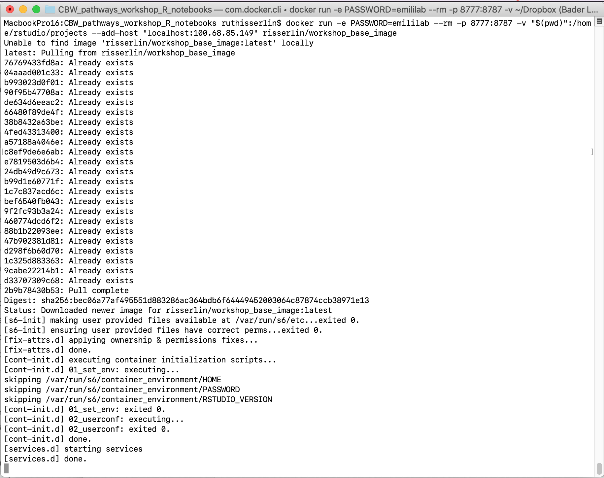

# Setup

## Install R and RStudio

As with many open source projects, **R** is a constantly evolving language with regular updates.  There is a major release once a year with patch releases through out the year.  Often scripts and packages will work from one release to the next (ignoring pesky warnings that a package was compiled on a previous version of R is common) but there are exceptions.  Some newer packages will only work on the latest version of **R** so sometimes the choice of upgrading or not using a new package might present themselves.  Often, the amount of packages and work that is need to upgrade is not realized until the process has begun.  This is where docker demonstrates it most valuable features.  You can create a new instance based on the latest release of **R** and all your needed packages without having to change any of your current settings. 

In order to use these notebooks supplied here you need to have:

  * **R** installed on your computer and 
  * a list of packages.  (including BiocManager, BiomaRt, gprofiler2, GSA)
  
Each notebook in this set will check for the required packages and install them if they are missing so at the base level you need to just have **R** installed.  

There are many different ways you can use and setup **R**.  

  1. By simply installing **R** you can use it directly but 
  1. it is highly recommended that you also install and use [RStudio](https://rstudio.com/products/rstudio/download/) which is an Integrate development environment (IDE) for **R**.  You cannot just download RStudio and use it.  It requires an installation of **R**. 

You don't need to install R and RStudio though.  You can also use **R** and RStudio through docker. **I highly recommend using docker instead**


## Docker [Optional]

Changing versions and environments are a continuing struggle with bioinformatics pipelines and computational pipelines in general.  An analysis written and performed a year ago might not run or produce the same results when it is run today.  Recording package and system versions or not updating certain packages rarely work in the long run.  

One the best solutions to reproducibility issues is containing your workflow or pipeline in its own coding environment where everything from the operating system, programs and packages are defined and can be built from a set of given instructions. There are many systems that offer this type of control including:

  * [Docker](https://www.docker.com/).
  * [Singularity](https://sylabs.io/)
  
"A container is a standard unit of software that packages up code and all its dependencies so the application runs quickly and reliably from one computing environment to another." [@docker] 

**Why are containers great for Bioiformatics?**

  * allows you to create environments to run bioinformatis pipelines.
  * create a consistent environment to use for your pipelines.
  * test modifications to the pipeline without disrupting your current set up.
  * Coming back to an analysis years later and there is no need to install older versions of packages or programming languages. Simply create a container and re-run.  

## Install Docker

  1. Download and install [docker desktop](https://www.docker.com/products/docker-desktop).
  1. Follow slightly different instructions for Windows or MacOS/Linux

### Windows
  * it might prompt you to install additional updates (for example - https://docs.Microsoft.com/en-us/windows/wsl/install-win10#step-4---download-the-linux-kernel-update-package) and require multiple restarts of your system or docker.
  * launch docker desktop app.
  * Open windows Power shell 
  * navigate to directory on your system where you plan on keeping all your code.  For example: C:\\USERS\\risserlin\\cbw_workshop_code
  * Run the following command: (the only difference with the windows command is the way the current directory is written.  \$\{PWD\} instead of \"\$(pwd)\")


```r
docker run -e PASSWORD=changeit --rm \
  -v ${PWD}:/home/rstudio/projects -p 8787:8787 \
  risserlin/workshop_base_image
```
<p align="center"></p>  
  * Windows defender firewall might pop up with warning.  Click on *Allow access*.
  * In docker desktop you see all containers you are running and easily manage them. 
<p align="center"></p>   


### MacOS / Linux
  * Open Terminal
  * navigate to directory on your system where you plan on keeping all your code.  For example: /Users/risserlin/bcb420_code
  * Run the following command: (the only difference with the windows command is the way the current directory is written.   \$\{PWD\} instead of \"\$(pwd)\")


```r
docker run -e PASSWORD=changeit --rm \
  -v "$(pwd)":/home/rstudio/projects -p 8787:8787 \
  --add-host "localhost:My.IP.address"
  risserlin/workshop_base_image
```
<p align="center"></p> 

