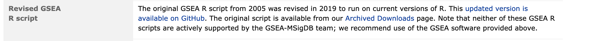

---
params:
  analysis_name: Mesen_vs_Immuno
  working_dir: ./data/
  rnk_file: MesenchymalvsImmunoreactive_edger_ranks.rnk
  gsea_jar: /home/rstudio/GSEA_4.3.2/gsea-cli.sh
  gsea_directory: ''
  run_gsea: false
---
# Run GSEA from within R

This notebook is based largely on the [original notebook](https://baderlab.github.io/Cytoscape_workflows/EnrichmentMapPipeline/Protocol2_createEM.html) published with EnrichmentMap Protocol[@em2019] 

There is no package to run the original algorithm of GSEA[@gsea2005] in R.  There are many packages that have been published to imitate the process but none are recognized by The GSEA team.  



## Load in required libraries


```r
#install required R and bioconductor packages
tryCatch(expr = { library("RCurl")}, 
         error = function(e) {  
           install.packages("RCurl")}, 
         finally = library("RCurl"))
```


## Configurable Parameters

In order to run GSEA automatically through the notebook you will need to download the gsea jar from [here](http://software.broadinstitute.org/gsea/downloads.jsp).  Specify the exact path to the gsea jar in the parameters in order to automatically compute enrichments using GSEA.

If you are running this notebook using the [baderlab workshop docker image](https://hub.docker.com/r/risserlin/workshop_base_image) then the image comes pre-installed with the gsea jar that you can use to run gsea directly in the docker.  The path to the GSEA jar in the docker is - /home/rstudio/GSEA_4.3.2/gsea-cli.sh

In order to run GSEA automatically you need to speciry the path to the gsea jar file.
The gsea_jar needs to be the full path to the GSEA 4.3.2 directory that you downloaded from GSEA. for example  /Users/johnsmith/GSEA_4.3.2/gsea-cli.sh

For each variable defined below there is an example of how you can set the variable using parameters so you can re-use your notebook with varying values and run completely from the command line.  For more info on how to set this up see [here](https://bookdown.org/yihui/rmarkdown/params-knit.html)


```r
#path to GSEA jar 
#gsea_jar <- params$gsea_jar --> if you want to define parameters 
#for the notebook and run as script you can pass this in as a parameter and 
# set it like this.
gsea_jar <- "/home/rstudio/GSEA_4.3.2/gsea-cli.sh"
```

Set the working directory as the directory to the directory where you downloaded all protocol files.  For example /User/JohnSmith/EMProtocolFiles/data


```r
#directory where all the data files are found.  For example -   ./data/ 
#working_dir <- params$working_dir --> if you want to define parameters 
#for the notebook and run as script you can pass this in as a parameter and 
# set it like this.
working_dir <- "./data/"

#The name to give the analysis in GSEA - for example Mesen_vs_Immuno
# analysis_name <- params$analysis_name --> if you want to define parameters 
#for the notebook and run as script you can pass this in as a parameter and 
# set it like this.
analysis_name <- "Mesen_vs_Immuno"

#rank file to use in GSEA analysis.  
#For example - MesenchymalvsImmunoreactive_edger_ranks.rnk
#rnk_file <- params$rnk_file --> if you want to define parameters 
#for the notebook and run as script you can pass this in as a parameter and 
# set it like this.
rnk_file <- "MesenchymalvsImmunoreactive_edger_ranks.rnk"

#run_gsea - true/false
# This parameter is for the compilation of the notebook.  
#run_gsea <- params$run_gsea --> if you want to define parameters 
#for the notebook and run as script you can pass this in as a parameter and 
# set it like this.
run_gsea <- FALSE
```


## Download the latest pathway definition file

Only Human, Mouse, Rat, and Woodchuck gene set files are currently available on the baderlab downloads site.  If you are working with a species other than human (and it is either rat,mouse or woodchuck) change the gmt_url below to the correct species. Check [here](http://download.baderlab.org/EM_Genesets/current_release/) to see all available species.

To create your own GMT file using Ensembl see [Create GMT file from Ensembl]


```r
gmt_url = "http://download.baderlab.org/EM_Genesets/current_release/Human/symbol/"

#list all the files on the server
filenames = getURL(gmt_url)
tc = textConnection(filenames)
contents = readLines(tc)
close(tc)

#get the gmt that has all the pathways and does not include terms 
# inferred from electronic annotations(IEA)
#start with gmt file that has pathways only and GO Biological Process only.
rx = gregexpr("(?<=<a href=\")(.*.GOBP_AllPathways_no_GO_iea.*.)(.gmt)(?=\">)",
  contents, perl = TRUE)
gmt_file = unlist(regmatches(contents, rx))

dest_gmt_file <- file.path(working_dir,gmt_file )

#check if this gmt file already exists
if(!file.exists(dest_gmt_file)){
  download.file(
    paste(gmt_url,gmt_file,sep=""),
    destfile=dest_gmt_file
  )
}
```

***
## Run GSEA
(GSEA)[http://software.broadinstitute.org/gsea/index.jsp] is a stand alone java program with many customizable options.  It can be easily run through its integrated user interface.  To make this a seemless pipeline we can run GSEA from the command line with a set of options.  Any of the supplied options can be customized and there are many additional options that can be specified.  For more details see (here)[http://software.broadinstitute.org/gsea/doc/GSEAUserGuideTEXT.htm#_Running_GSEA_from]

In the below command the following options have been specified:

 * rnk - path to the rank file
 * gmx - path to the gene set definition (gmt) file
 * collapse - true/false indicates whether the expression/rnk file needs to be collapsed from probes to gene symbols
 * nperm - number of permutations
 * scoring_scheme - 
 * rpt_label - name of the directory with output
 * rnd_seed - random seed to use
 * set_max - maximum size for individual gene sets.  In GSEA interface this is set to 500 but we prefer to use a more stringent setting of 200. 
 * set_min - minimum size for individual gene sets 
 * zip_report - true/false to zip output directory
 * out - directory where to place the result directory.

 

```r
if(run_gsea){
  command <- paste("",gsea_jar,  
                   "GSEAPreRanked -gmx", dest_gmt_file, 
                   "-rnk" ,file.path(working_dir,rnk_file), 
                   "-collapse false -nperm 1000 -scoring_scheme weighted", 
                   "-rpt_label ",analysis_name,
                   "  -plot_top_x 20 -rnd_seed 12345  -set_max 200",  
                   " -set_min 15 -zip_report false ",
                   " -out" ,working_dir, 
                   " > gsea_output.txt",sep=" ")
  system(command)
}
```
