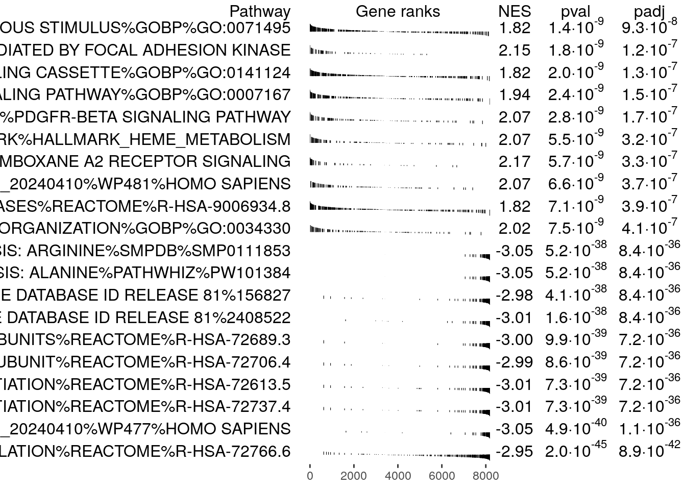

---
params:
  analysis_name: BRCA_hd_tep
  working_dir: ./data/
  output_dir: ./generated_data/fgsea/
  rnk_file: brca_hd_tep_ranks.rnk
  gsea_jar: /home/rstudio/GSEA_4.3.3/gsea-cli.sh
  gsea_directory: 'data/Human_GOBP_AllPathways_noPFOCR_no_GO_iea_May_01_2024_symbol.gmt'
  run_fgsea: true
---
# Run fGSEA from within R

This notebook is based largely on the [original notebook](https://baderlab.github.io/Cytoscape_workflows/EnrichmentMapPipeline/Protocol2_createEM.html) published with EnrichmentMap Protocol[@em2019] 

## Load in required libraries


``` r
#install required R and bioconductor packages
tryCatch(expr = { library("RCurl")}, 
         error = function(e) {  
           install.packages("RCurl")}, 
         finally = library("RCurl"))

tryCatch(expr = { library("fgsea")}, 
         error = function(e) {  
           install.packages("fgsea")}, 
         finally = library("fgsea"))

tryCatch(expr = { library("GSA")}, 
         error = function(e) {  
           install.packages("GSA")}, 
         finally = library("GSA"))

tryCatch(expr = { library("benchmarkme")}, 
         error = function(e) {  
           install.packages("benchmarkme")}, 
         finally = library("benchmarkme"))
```

## function to write out fGSEA results
Create function to write out fgsea results files for each sample

``` r
write_sample_fgsea_results<- function(current_fgsea_results, current_results_dir, 
                                       current_sample){
    
  current_sample <- current_sample
  
    current_sample_directory_fullpath <- file.path(current_results_dir, current_sample)
    if(!dir.exists(current_sample_directory_fullpath)){
      dir.create(current_sample_directory_fullpath)
    }
  
    #calculate the rank at max
    #fgsea returns the leading edge.  Just need to extract the highest rank from 
    # set to get the rank at max
    calculated_rank_at_max <- apply(current_fgsea_results,1,FUN=function(x){ max(which(names(current_ranks) %in% unlist(x[8])))})
    
    
    fakeenr_current_sample <- cbind(current_fgsea_results$pathway,
                                     current_fgsea_results$pathway,
                                     "Details",
                                     current_fgsea_results$size,
                                     current_fgsea_results$ES,
                                     current_fgsea_results$NES,
                                     current_fgsea_results$pval,
                                     current_fgsea_results$padj,
                                     0,
                                     calculated_rank_at_max,
                                     apply(current_fgsea_results,1,
                                           FUN=function(x){paste(unlist(x[8]),collapse=",")})) 
    
    colnames(fakeenr_current_sample) <- c("name","description","GS details","SIZE","ES","NES","pval","padj","FWER","Rank at Max","leading edge genes")
    
    fakeenr_filename <- paste0(current_sample, "_fgsea_enr_results.txt",sep="")
    fakeenr_filename_docker <- file.path(current_sample_directory_fullpath,fakeenr_filename)
    
    write.table(fakeenr_current_sample ,
                fakeenr_filename_docker,
                col.name=TRUE,sep="\t",row.names=FALSE,quote=FALSE,fileEncoding="latin1")
    
    # "upload" the files to the host machine and replace each path with the host machine path
    
    #create a fake expression file
    fakeexp <- data.frame(name = names(current_ranks), 
                          description = names(current_ranks),current_ranks)
    fakeexp_filename <- paste0(current_sample,"fakeexpression.txt",sep="")
    fakeexp_name_docker <- file.path( current_sample_directory_fullpath,fakeexp_filename)

    write.table(fakeexp,
                fakeexp_name_docker,
                col.name=TRUE,sep="\t",row.names=FALSE,quote=FALSE,fileEncoding="")
    
    
    #create a rank expression file
    fakernk <- data.frame(name = names(current_ranks), 
                          current_ranks)
    fakernk_filename <- paste0(current_sample,"fakeranks.rnk",sep="")
    fakernk_name_docker <- file.path( current_sample_directory_fullpath,fakernk_filename)

    write.table(fakernk,
                fakernk_name_docker,
                col.name=TRUE,sep="\t",row.names=FALSE,quote=FALSE,fileEncoding="")
    
      
}
```


## Configurable Parameters

Set the working directory as the directory to the directory where you downloaded all protocol files.  For example /User/JohnSmith/EMProtocolFiles/data


``` r
# defined in the paramters at top of notebook

#directory where all the data files are found.  For example -   ./data/ 
working_dir <- params$working_dir

#directory where all the data files are found.  For example -   ./generated_data/gsea/
output_dir <- params$output_dir
if(!exists(output_dir)){
  dir.create(output_dir)
}

#The name to give the analysis in GSEA - for example Basal_vs_Classical
analysis_name <- params$analysis_name

#rank file to use in GSEA analysis.  
#For example - TCGA-PAAD_GDC_Subtype_Moffitt_BasalvsClassical_ranks.rnk
rnk_file <- params$rnk_file

#run_gsea - true/false
# This parameter is for the compilation of the notebook.  
run_fgsea <- params$run_fgsea

#set the gmt file you want to use if you don't want to use the latest gmt file.
# For example, if you set dest_gmt_file =="" the below script will automatically
# download the latest gmt file from baderlab webstie.  If it is set then it
# will use the file specified.  
dest_gmt_file = params$gsea_directory
```


## Download the latest pathway definition file

Only Human, Mouse, Rat, and Woodchuck gene set files are currently available on the baderlab downloads site.  If you are working with a species other than human (and it is either rat,mouse or woodchuck) change the gmt_url below to the correct species. Check [here](http://download.baderlab.org/EM_Genesets/current_release/) to see all available species.

To create your own GMT file using Ensembl see [Create GMT file from Ensembl]


``` r
if(dest_gmt_file == ""){
  gmt_url = "http://download.baderlab.org/EM_Genesets/current_release/Human/symbol/"
  
  #list all the files on the server
  filenames = getURL(gmt_url)
  tc = textConnection(filenames)
  contents = readLines(tc)
  close(tc)
  
  #get the gmt that has all the pathways and does not include terms 
  # inferred from electronic annotations(IEA)
  #start with gmt file that has pathways only and GO Biological Process only.
  rx = gregexpr("(?<=<a href=\")(.*.GOBP_AllPathways_noPFOCR_no_GO_iea.*.)(.gmt)(?=\">)",
    contents, perl = TRUE)
  gmt_file = unlist(regmatches(contents, rx))
  
  dest_gmt_file <- file.path(output_dir,gmt_file )
  
  #check if this gmt file already exists
  if(!file.exists(dest_gmt_file)){
    download.file(
      paste(gmt_url,gmt_file,sep=""),
      destfile=dest_gmt_file
    )
  }
}else {
  file.copy(dest_gmt_file,to = output_dir)
}
```

```
## [1] TRUE
```

``` r
#load in the genesets.
capture.output(all_gs <- GSA.read.gmt(dest_gmt_file) ,file="gsa_load.out")
names(all_gs$genesets) <- all_gs$geneset.names
```

***
## Run fGSEA
(fGSEA)[https://bioconductor.org/packages/release/bioc/html/fgsea.html] is an R package that runs a fast Gene Set Enrichment Analysis.    

In the below command the following options have been specified:

 * pathways - list of genesets to use for the calculation
 * stats - genes and their associated statistic, sorted 
 * max_size - maximum size for individual gene sets.  In GSEA interface this is set to 500 but we prefer to use a more stringent setting of 200. 
 * min_size - minimum size for individual gene sets 

 

``` r
start_time <- Sys.time()

if(run_fgsea){
  #get the subset of genes that are protein coding. 
    current_ranks <- read.table(file.path(working_dir,rnk_file),header=TRUE,sep = "\t")
    fgsea_ranks <- current_ranks[,2]
    names(fgsea_ranks) <- current_ranks[,1]
 
    current_ranks <- fgsea_ranks
 
    #remove duplicated genes
    duplicated_gene_names <-   
      names(current_ranks)[which(duplicated(names(current_ranks)))]
    current_ranks <- current_ranks[which(!names(current_ranks) %in% 
                                           duplicated_gene_names)]

    current_ranks <- sort(current_ranks,decreasing = TRUE)
    set.seed(42)
    current_fgsea_results <- fgsea::fgsea(all_gs$genesets, 
                                      sort(current_ranks,decreasing=TRUE),
                                      minSize=15,
                                      maxSize = 500
                                      )
    
    #write out the fgsea results for this patient
      write_sample_fgsea_results(current_fgsea_results,output_dir,analysis_name)
      

}
```

```
## Warning in preparePathwaysAndStats(pathways, stats, minSize, maxSize, gseaParam, : There are ties in the preranked stats (0.01% of the list).
## The order of those tied genes will be arbitrary, which may produce unexpected results.
```

```
## Warning in write.table(fakeenr_current_sample, fakeenr_filename_docker, :
## invalid char string in output conversion
## Warning in write.table(fakeenr_current_sample, fakeenr_filename_docker, :
## invalid char string in output conversion
```

``` r
end_time <- Sys.time()
```

## System Stats

RAM - 


``` r
get_ram()
```

```
## 90.1 GB
```

CPU - 


``` r
get_cpu()
```

```
## $vendor_id
## [1] "GenuineIntel"
## 
## $model_name
## [1] "Intel(R) Xeon(R) CPU E5-2697 v2 @ 2.70GHz"
## 
## $no_of_cores
## [1] 24
```
R version - 


``` r
get_r_version()
```

```
## $platform
## [1] "x86_64-pc-linux-gnu"
## 
## $arch
## [1] "x86_64"
## 
## $os
## [1] "linux-gnu"
## 
## $system
## [1] "x86_64, linux-gnu"
## 
## $status
## [1] ""
## 
## $major
## [1] "4"
## 
## $minor
## [1] "4.0"
## 
## $year
## [1] "2024"
## 
## $month
## [1] "04"
## 
## $day
## [1] "24"
## 
## $`svn rev`
## [1] "86474"
## 
## $language
## [1] "R"
## 
## $version.string
## [1] "R version 4.4.0 (2024-04-24)"
## 
## $nickname
## [1] "Puppy Cup"
```


Run on Intel(R) Xeon(R) CPU E5-2697 v2 @ 2.70GHz with 24 and 9.0146152\times 10^{10} of RAM using Linux version #1 SMP PREEMPT_DYNAMIC Fri Nov 29 17:24:06 UTC 2024

## Timing

fGSEA started at 2025-04-30 14:21:01.632425

fGSEA finished at 2025-04-30 14:21:20.66858

fGSEA total running time - 


``` r
end_time - start_time
```

```
## Time difference of 19.03616 secs
```


## Results presented as R table


``` r
topPathwaysUp <- current_fgsea_results[ES > 0][head(order(pval), n=10), pathway]
topPathwaysDown <- current_fgsea_results[ES < 0][head(order(pval), n=10), pathway]
topPathways <- c(topPathwaysUp, rev(topPathwaysDown))
plotGseaTable(all_gs$genesets[topPathways], current_ranks, current_fgsea_results, 
              gseaParam=0.5)
```




