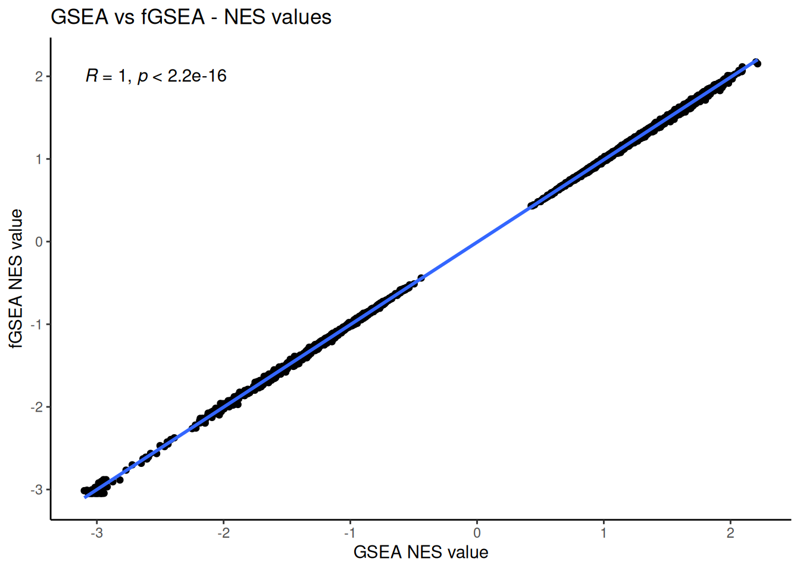
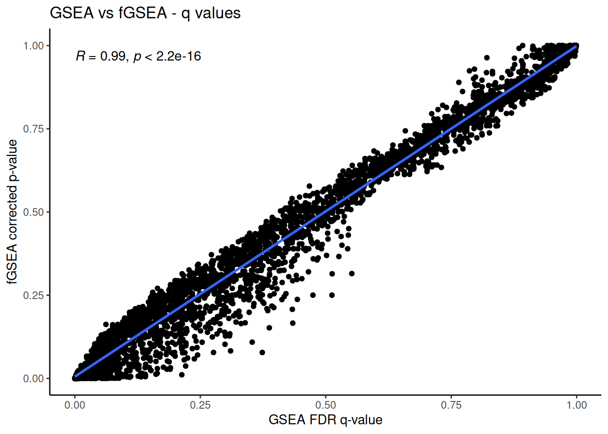

---
params:
  output_dir: ./generated_data
---

# Compare Outputs of fGSEA and GSEA

## Load in required libraries and files. 

Load required libraries


``` r
tryCatch(expr = { library("ggpubr")}, 
         error = function(e) {  
             install.packages("ggpubr")}, 
         finally = library("ggpubr"))
```

```
## Loading required package: ggplot2
```

``` r
tryCatch(expr = { library("ggplot2")}, 
         error = function(e) {  
             install.packages("ggplot2")}, 
         finally = library("ggplot2"))
```


Load in the output files for each of the analysis and compare the NES values generated by each method


``` r
#list directories in generated data directory
output_directories <- list.dirs(params$output_dir,recursive = FALSE,full.names = FALSE)
```

go through the directories and load in the results


``` r
for(i in 1:length(output_directories)){
  
  current_directory <- output_directories[i]
  
  if(current_directory == "fgsea"){
    fgsea_results_filename <- list.files(file.path(params$output_dir,current_directory),
                                         pattern = "fgsea_enr_results",
                                         recursive = TRUE,
                                         full.names = TRUE)
    
    fgsea_results <- read.table(file = fgsea_results_filename,
                                header = TRUE,sep = "\t",quote = "")
  } else if (current_directory == "gsea"){
    #load in the negative results file
    gsea_neg_results_filename <- grep(list.files(file.path(params$output_dir,current_directory),
                                         pattern = "gsea_report_for_na_neg",
                                         recursive = TRUE,
                                         full.names = TRUE),pattern="tsv",value = TRUE)
    gsea_neg_results <- read.table(file = gsea_neg_results_filename,
                                header = TRUE,sep = "\t",quote = "")
    
    #load inthe positive results file
    gsea_pos_results_filename <- grep(list.files(file.path(params$output_dir,current_directory),
                                         pattern = "gsea_report_for_na_pos",
                                         recursive = TRUE,
                                         full.names = TRUE),pattern="tsv",value = TRUE)
    gsea_pos_results <- read.table(file = gsea_pos_results_filename,
                                header = TRUE,sep = "\t",quote = "")

    #merge the two results files
    gsea_results <- rbind(gsea_neg_results,gsea_pos_results)
    
      }
  }
```


Merge the two different sets of results


``` r
merged_results <-  merge(gsea_results,fgsea_results,by.x = 1, by.y=1, all =TRUE)
```

## Compare NES values

Graph the NES values computed from each method



## Compare p-values

compare the p-values


## Compare corrected p- values

compare the corrected p-values




