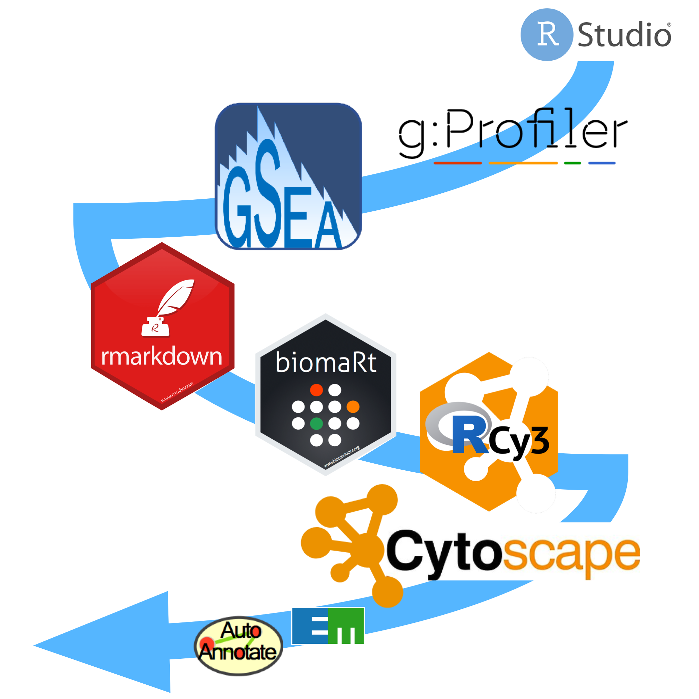

--- 
title: "CBW pathways Workshops - example R notebooks"
author: "Ruth Isserlin"
date: "2024-06-19"
site: bookdown::bookdown_site
output: bookdown::gitbook
documentclass: book
bibliography: [book.bib, packages.bib]
biblio-style: apalike
cover-image: images/cover.png
link-citations: yes
github-repo: risserlin/CBW_pathways_workshop_R_notebooks
description: "These are example R Notebooks to run g:profiler and GSEA and visualize results in Cytoscape with Enrichment map directly from R"
---

# Index

